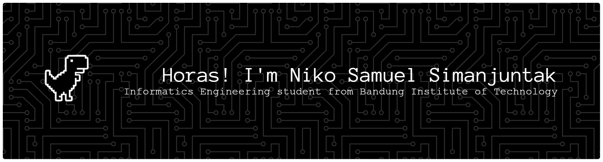

  

   

  

    I’m focused on building strong fundamentals in algorithms and software engineering,  
    with a strong interest in competitive programming and problem solving.
  

   

  <h3>Let's Connect</h3>

  

    
    &nbsp; 
    &nbsp; 
    &nbsp; 
  

   

